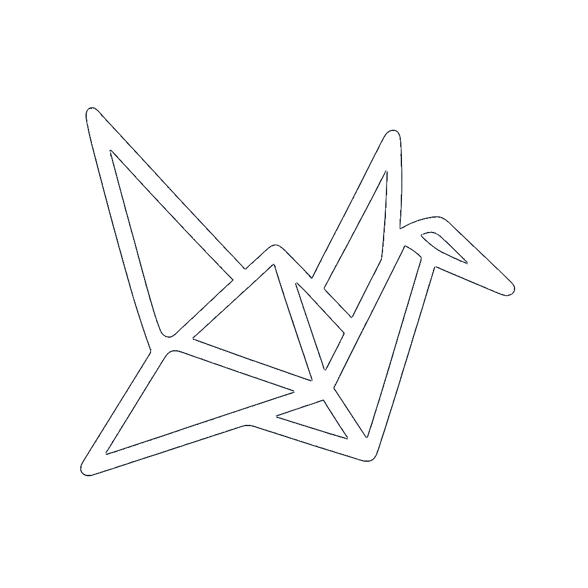

#  Kondo

## Generate material to organize into bookmarks and cycle in dojo

<!--  -->


##  Dojo: lower ranked responses across all bookmarks are compiled daily to study


##  Dissect/breakdown generated material


##  Dojo: flashcard mode
<div style="display: flex; gap: 10px; flex-wrap: wrap; justify-content: center;">
  <div style="flex: 1; max-width: 50%; min-width: 300px; display: flex; justify-content: center;">
    
  </div>
  <div style="flex: 1; max-width: 50%; min-width: 300px; display: flex; justify-content: center;">
    
  </div>
</div>

## Generate and organize study material to learn new languages
- Use commands and phrases to generate study material: 
  - random + (optional) \<topic\> + (optional) \<difficulty\>
  - topic + \<topic\>
  - verb + \<verb\>
- For Japanese, you will receive a translation in 1/ Japanese (w/ kanji), 2/ hiragana + katakana, 3/ romaji, 4/ english
  - User reply icon to get a word by word breakdown of the translation, including grammar points and topic particles
- Bookmark your responses and rank them, more poorly ranked responses will be shown first while higher ranked responses will be shown last
- View a daily summary of your bookmarked responses (dojo), less familiar topics will be shown more frequently
  - Responses can be 'paused' or 'resumed' from cycling in dojo

This is a [Next.js](https://nextjs.org) project bootstrapped with [`create-next-app`](https://nextjs.org/docs/app/api-reference/cli/create-next-app).

## Getting Started

First, run the development server:

```bash
npm run dev
# or
yarn dev
# or
pnpm dev
# or
bun dev
```


Open [http://localhost:3000](http://localhost:3000) with your browser to see the result.

You can start editing the page by modifying `app/page.tsx`. The page auto-updates as you edit the file.

This project uses [`next/font`](https://nextjs.org/docs/app/building-your-application/optimizing/fonts) to automatically optimize and load [Geist](https://vercel.com/font), a new font family for Vercel.

## Learn More

To learn more about Next.js, take a look at the following resources:

- [Next.js Documentation](https://nextjs.org/docs) - learn about Next.js features and API.
- [Learn Next.js](https://nextjs.org/learn) - an interactive Next.js tutorial.

You can check out [the Next.js GitHub repository](https://github.com/vercel/next.js) - your feedback and contributions are welcome!

## Deploy on Vercel

The easiest way to deploy your Next.js app is to use the [Vercel Platform](https://vercel.com/new?utm_medium=default-template&filter=next.js&utm_source=create-next-app&utm_campaign=create-next-app-readme) from the creators of Next.js.

Check out our [Next.js deployment documentation](https://nextjs.org/docs/app/building-your-application/deploying) for more details.
